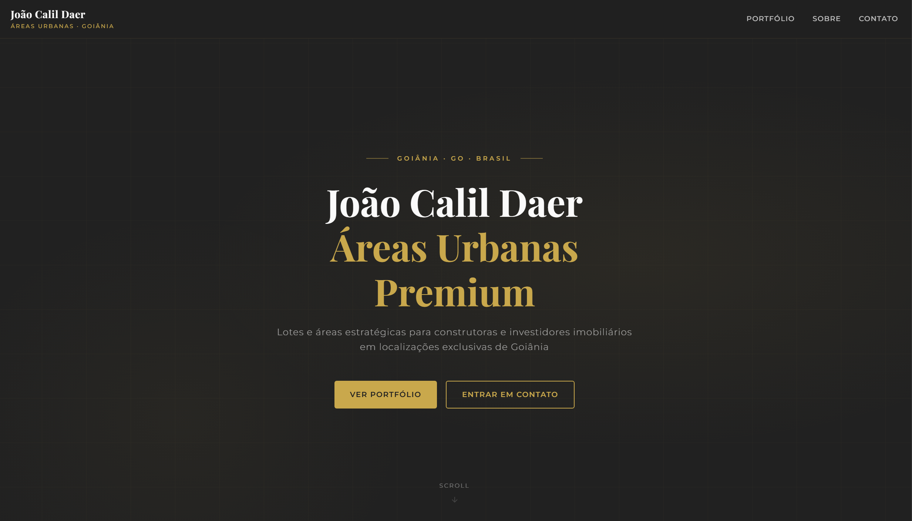
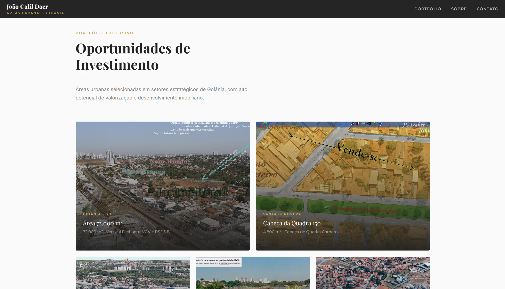
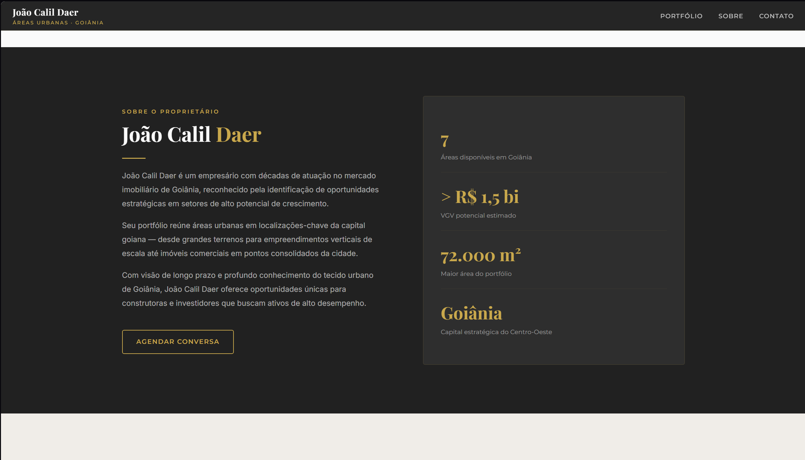

# Oi, eu sou o João 👋

Comecei a me interessar por computação antes mesmo de saber que isso podia virar carreira. Hoje estudo Ciência da Computação na PUC-GO (turma de 2024) e trabalho com Power BI e automação de processos — basicamente, faço código trabalhar no lugar de gente.

O que mais me motiva é ver um script ou uma automação resolvendo um problema real. Parece simples, mas quando você economiza horas de trabalho manual de alguém com algumas linhas de código, bate uma satisfação difícil de explicar.

---
## O que eu sei

Python e Power BI são as ferramentas que mais uso — automações, manipulação de dados e dashboards. Também trabalhei com SQL e banco de dados.

---
## O que estou aprendendo

Estou construindo minha base em desenvolvimento web, com foco em entender o que acontece dos dois lados — front e back.

---

## No que estou trabalhando

- Projetos pessoais pra consolidar o que aprendo na faculdade
- Automações que resolvem problemas do dia a dia
- Dashboards em Power BI

Ainda estou no começo, mas cada projeto aqui é algo que eu realmente construí pra funcionar — não só pra parecer bem no portfólio.

---

## 🚀 Projetos em destaque

🔹 Automação SharePoint  
→ Script que sincroniza Excel com SharePoint automaticamente  

🔹 Geração de relatórios em PDF  
→ Automatiza dashboards a partir de planilhas  

🔹 Site imobiliário  
→ Projeto real com HTML e CSS

### João Calil Daer — Site Imobiliário
Site institucional desenvolvido para um cliente do mercado imobiliário de Goiânia. Design escuro com tipografia elegante e paleta dourada, feito inteiro em HTML e CSS puro.

| | |
|---|---|
|  |  |
|  | |

**Tecnologias:** `HTML` `CSS`

---

## Aberto a

Freela, projetos colaborativos e qualquer oportunidade de aprender com gente mais experiente. Se você tiver um projeto interessante, pode chegar.

---

## Onde me encontrar

---

PUC-GO • Goiás, Brasil
